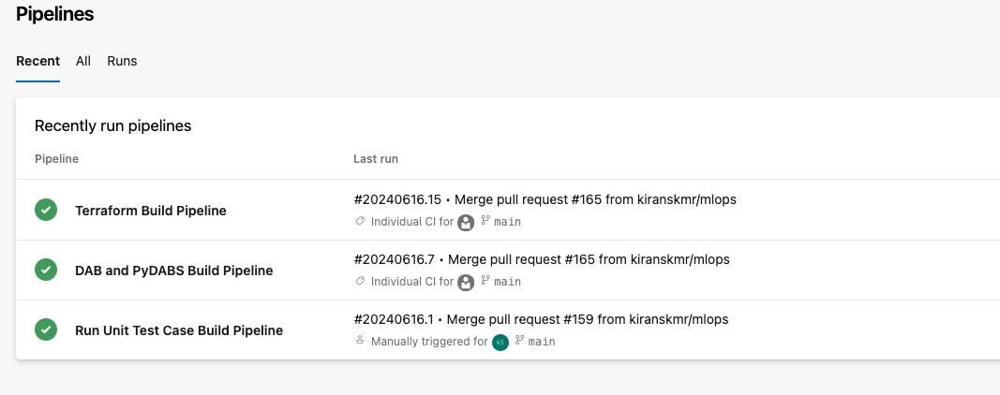
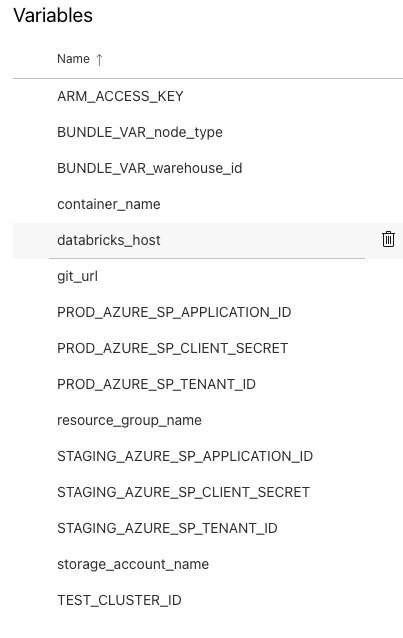
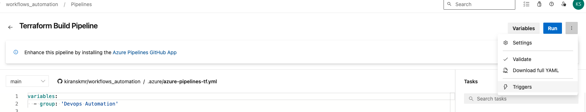
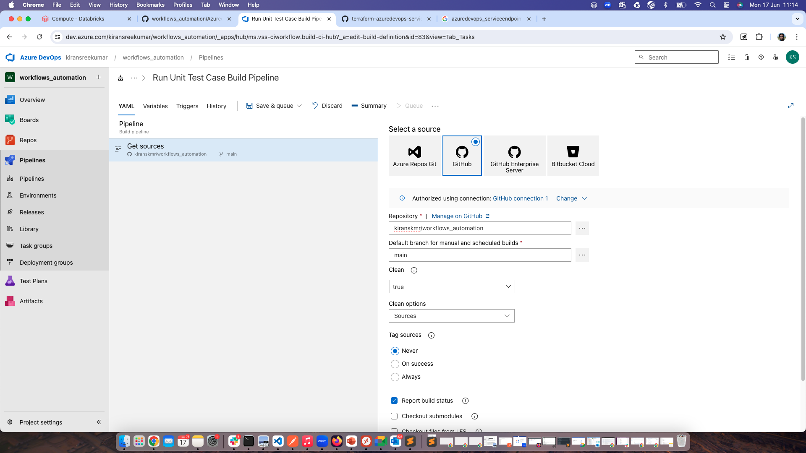
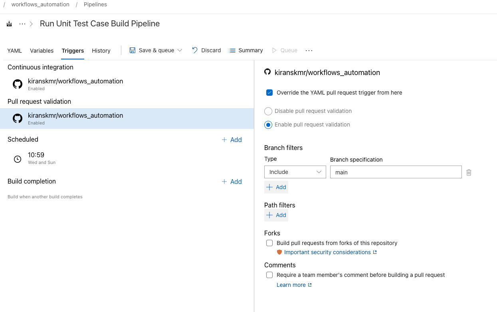

## Set up Azure Devops project and pipeline set up using terraform

Fork this repo to your github.

To deploy the code via an Azure cicd pipeline, go to your org in azure devops and generate a personal access token.


eg org URL: https://dev.azure.com/kiransreekumar/

click on the user settings icon on the top right and personal access tokens.

New token -> Give a name and expiration and choose a scope.Make a note of the token and save it securely.


Add the below environment variables in you local development IDE.

```
export AZDO_ORG_SERVICE_URL=https://dev.azure.com/<your azure devops org name>
export AZDO_PERSONAL_ACCESS_TOKEN=<add your azure devops token>
```


create a github token from github developer settings.


export GITHUB_TOKEN=<your github token>

### Install azure cli 

[For mac](https://learn.microsoft.com/en-us/cli/azure/install-azure-cli-macos) 


- brew update 
- brew install azure-cli


Login to the azure account from cli

```az login```


run terraform commands to create the devops pipeline.

This will deploy the following components.


 - Creates a  cluster in databricks workspace for running test cases
 - Deploys a project workflows_automation in Azure devops
 - Deploys 3 pipelines in Azure devops
 - Creates a variable group in Azure devops
 - Create a sql warehouse to be used in DBT job
 - Links the github account to Azure devops
 - Creates a resource group, storage account and container to be used as terraform backend
 - deploys 3 catalogs dev,test.prod and creates the required schemas in Unity Catalog
 


```
cd terraform/modules/azuredevops
terraform plan -var git_url=<https://github.com/kiranskmr/workflows_automation>
terraform apply -var -var git_url=<https://github.com/kiranskmr/workflows_automation>
```
 



 
```
Update the variable group with the required properties.


databricks_host 
BUNDLE_VAR_node_type i3.xlarge for AWS / Standard_DS3_v2 for Azure/ n1-standard-4 for gcp

git_url = Add your Git URL here <https://github.com/kiranskmr/workflows_automation/>

The below is the service principal details which needs to be added.
The service principal needs to be given all grants on the catalogs, dev,test and prod in Unity catalog.
The service principal should also be added to the workspace and given access to the 
compute created like the sql warehouse and the cluster.

PROD_AZURE_SP_APPLICATION_ID
PROD_AZURE_SP_CLIENT_SECRET
PROD_AZURE_SP_TENANT_ID
STAGING_AZURE_SP_APPLICATION_ID
STAGING_AZURE_SP_CLIENT_SECRET
STAGING_AZURE_SP_TENANT_ID
```




```
Update Azure devops to enable the automated builds.


Open the pipeline and click edit and triggers.
```




```
In the YAML tab update the Get Sources to point to GitHub from Azure Repos Git 
and provide the 

Repository <kiranskmr/workflows_automation>
Default branch for manual and scheduled builds <main>


```




```

In the Triggers tab click "Override the YAML pull request trigger from here"

and enable pull request validation

```

