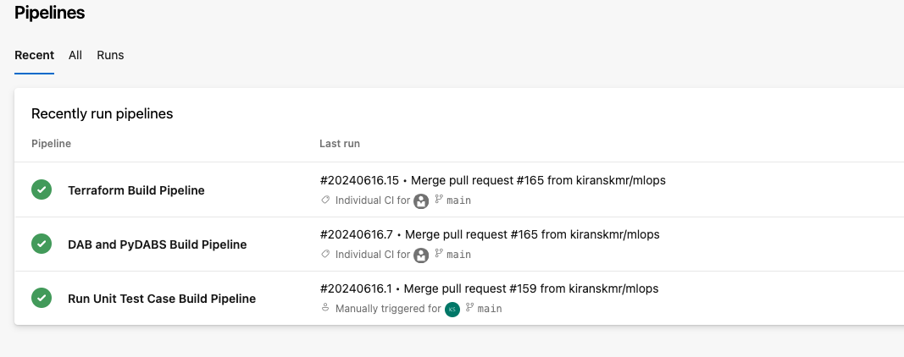
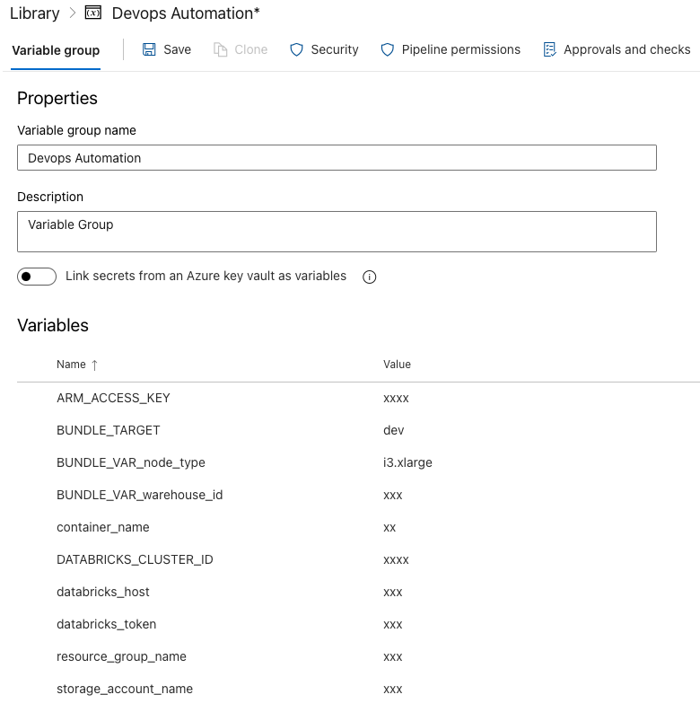

## Set up Azure Devops project and pipeline set up using terraform


To deploy the code via an Azure cicd pipeline, go to your org in azure devops and generate a personal access token.


eg org URL: https://dev.azure.com/kiransreekumar/

click on the user settings icon on the top right and personal access tokens.

New token -> Give a name and expiration and choose a scope.Make a note of the token and save it securely.


Add the below environment variables in you local development IDE.

```
export AZDO_ORG_SERVICE_URL=https://dev.azure.com/<your azure devops org name>
export AZDO_PERSONAL_ACCESS_TOKEN=<add your azure devops token>
```


create a github token from github developer settings.


export GITHUB_TOKEN=<your github token>

### Install azure cli 

[For mac](https://learn.microsoft.com/en-us/cli/azure/install-azure-cli-macos) 


- brew update 
- brew install azure-cli


Login to the azure account from cli

```az login```


run terraform commands to create the devops pipeline.

```
cd terraform/modules/azuredevops
terraform plan -var git_url=<https://github.com/kiranskmr/workflows_automation>
terraform apply -var -var git_url=<https://github.com/kiranskmr/workflows_automation>
```
 
This will create  an azure devops pipeline , a variable group and storage account for terraform backend.



 

Update the variable group with the required properties.
databricks_host 
databricks_token
BUNDLE_VAR_node_type i3.xlarge for AWS / Standard_DS3_v2 for Azure/ n1-standard-4 for gcp



