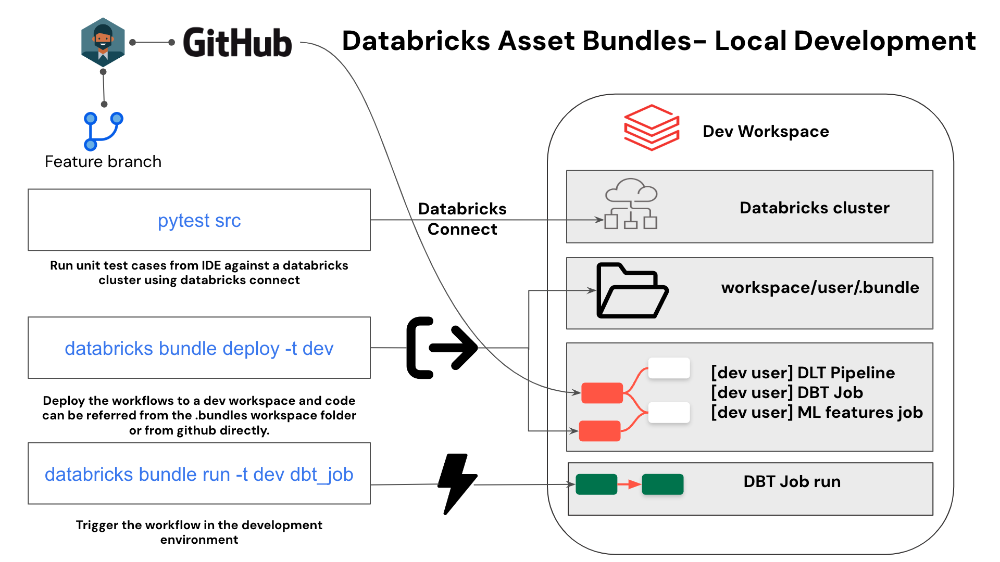
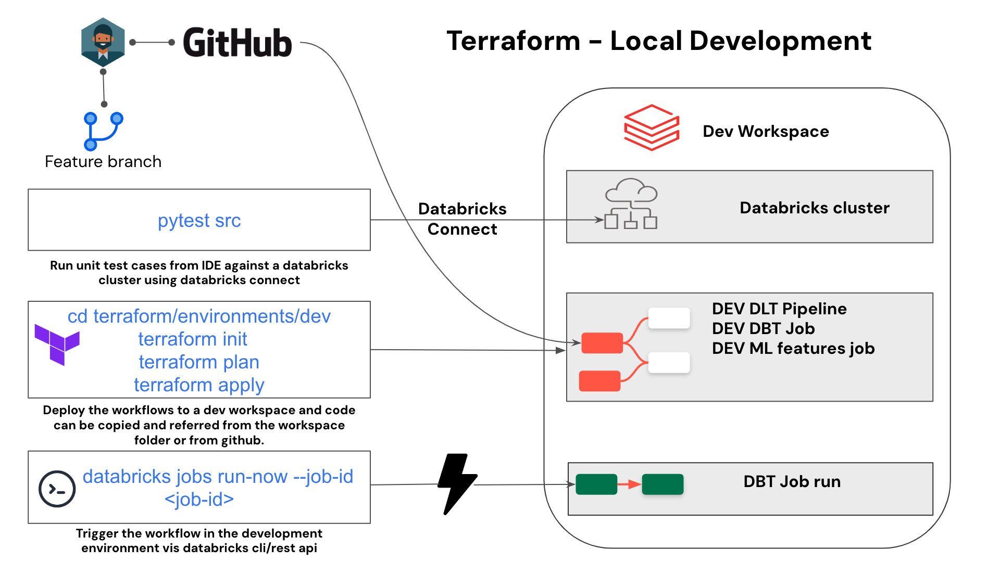
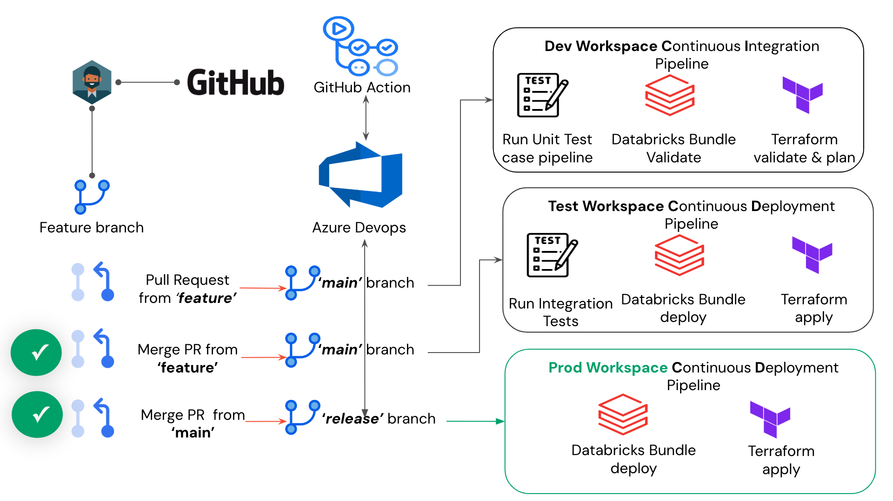

# Databricks Workflows Atomation and CI/CD integration 

How to automate Databricks workflow deployments and integrate with your CI/CD pipeline.

## Workflows Atomation
There are different ways you can automate the workflows deployments.

- Databricks Asset bundles (Yaml Based)
- PyDabs (Python version of Databricks Asset Bundles)
- Databricks Terraform Provider
- Python SDK
- Rest API

The repo contains examples of automating your workflows using

([Databricks Asset Bundles](https://docs.databricks.com/en/dev-tools/bundles/index.html))

The job definition part under dab_resources folder has examples of deploying diferent Job types in databricks workflows.

        - DABS - Customer Order Details - DLT job (dab_resources/dlt_dab_wf_job.yml) 
        - DABS - Customer Order Details - DBT job (dab_resources/dbt_dab_wf_job.yml) 
        - DABS - Python whl File from Volume job (dab_resources/wheel_wf_job.yml) 
        - DABS - MLOPS Write feature table job (dab_resources/feature-engineering-workflow-resource.yml) 
        - DABS - MLOPS Model training job (dab_resources/model-workflow-resource.yml)
        - DABS - MLOPS Batch inference job (dab_resources/batch-inference-workflow-resource.yml) 

 

([Terraform](https://registry.terraform.io/providers/databricks/databricks/latest/docs))

The terraform code under terraform/modules/ has examples of deploying the above jobs using Terraform scripts. 
The job definitions are grouped under modules (terraform/modules).

        - Terraform - Customer Order Details - DLT job (terraform/modules/dlt-pipeline)
        - Terraform - Customer Order Details - DBT job (terraform/modules/dbt-pipeline)
        - Terraform - Python whl File from Volume job (terraform/modules/wheel-job)
        - Terraform - MLOPS Model-training-job (terraform/modules/mlops-job)
        - Terraform - MLOPS Model-training-job (terraform/modules/mlops-job)

PyDabs (Private Preview)

The Python based workflows code under src/jobs has examples of deploying the below jobs using PyDABS.

         - PyDABS - Detect Anomalies job
         - PyDABS - Notebook Job
         - PyDABS - Task Values job

The pydabs code under src/jobs are used to generate the corresponding YML file to be deployed as part of the asset bundle deployment.

## CI/CD integration 

The repo has examples of integrating with different CI/CD platforms 

Azure Devops

There are three pipelines defined for Azure Devops integration

   - Deploying a Databricks Asset bundles based workflows to databricks -  azure-pipelines-dab.yml
   - Deploying a Terraform based workflows to databricks -  azure-pipelines-tf.yml
   - Deploying a pipeline to run pytests -  azure-pipelines-testcase.yml

Github Actions

There are five pipelines defined for Github Actions integration

   - Deploying a Databricks Asset bundles based workflows to Databricks  CI -  .github/workflows/dabsDeploymentCI.yml
   - Deploying a Databricks Asset bundles based workflows to Databricks  CD -  .github/workflows/dabsDeploymentCD.yml
   - Deploying a Terraform based workflows to Databricks CI -   .github/workflows/TerraformDeploymentCI.yml
   - Deploying a Terraform based workflows to Databricks CD -   .github/workflows/TerraformDeploymentCD.yml
   - Running Unit test case using pytest -   .github/workflows/testCase.yml

The pipeline is deployed using the below wokflows.

A developer works on a feature branch localy in his IDE.
All testing and deployment against a databricks workspace is done locally.
A pull request is raised against the 'main' branch which triggers 
 - The test case pipleine
 - The CI pipeline for DABS/PyDABS
 - The CI pipeline for Terraform

 When the pull request is merged to the 'main' branch it triggers
 - The CD pipeline for DABS/PyDABS which deploys to the test workspace
 - The CD pipeline for Terraform which deploys to the test workspace

 When a pull request is created and merged to the 'release' branch it triggers
 - The CD pipeline for DABS/PyDABS which deploys to the prod workspace
 - The CD pipeline for Terraform which deploys to the prod workspace

 
## Running test cases

The repo has examples of running pytests and integrating the same in a ci/cd workflow 

Test cases under src/tests are run againts a predefined cluster in a databricks workspace using Databricks Connect

Running pytes test cases using [Databricks Connect](https://docs.databricks.com/en/dev-tools/databricks-connect/index.html).

[Local Environment set up ](localSetup.md)

[Azure Devops Deployment](Azuredevops.md)

[Github Actions Deployment](Githubactions.md)